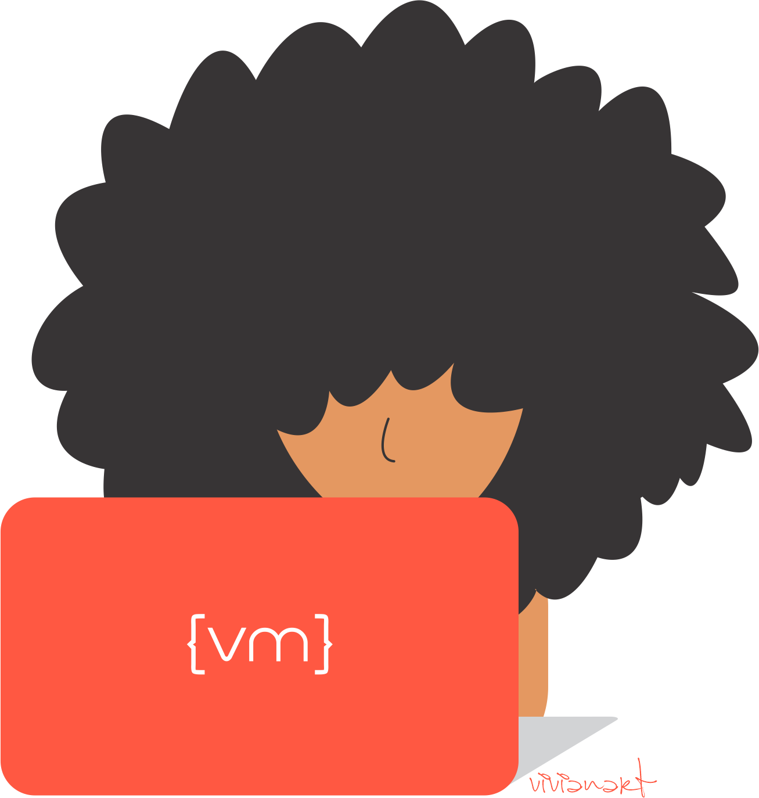
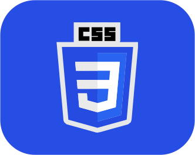
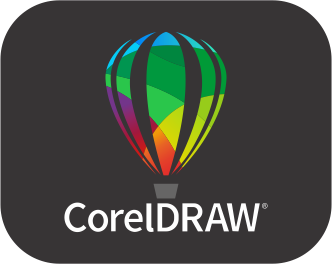

    
### ¡Hola! mi nombre es Vivian 😃
    

    
Programadora Junior. Soy colombiana, actualmente residente en España. Disfruto del diario aprendizaje, tengo buena disposición para el análisis y la resolución de problemas. Me encanta la programación y desarrollo de aplicaciones. Me entusiasma trabajar con PHP y formarme en nuevas tecnologías. 
Me gusta hacer dibujos a lápiz ✏️ y adoro leer novelas románticas 📚.

<ul>
    <li type=square>💻 He colaborado recientemente en la administración de base de datos y desarrollos back-end de proyectos web como:
        <ul>
            <li type=square><a href="https://camisetasencolores.es/">Camisetas en Colores</a></li>
            <li type=square><a href="https://suministroslasidero.com/">Suministros La Sidero</a></li>
        </ul>
    </li>
    <li type=square>📝 Actualmente me interesa Laravel, Symfony y Angular.</li>
    <li type=square>📫 Contáctame <a href="mailto:martinezpvivi@gmail.com">martinezpvivi@gmail.com</a></li>
    <li type=square>🙋‍♀️ Encuéntrame en <a href="https://www.linkedin.com/in/vivian-mart%C3%ADnez-920803277/"><strong>Linkedin</strong></a></li>
</ul>

#### 🛠️ Lenguajes, Herramientas y Plataformas:

#### 🖥️ Mis Estadísticas

